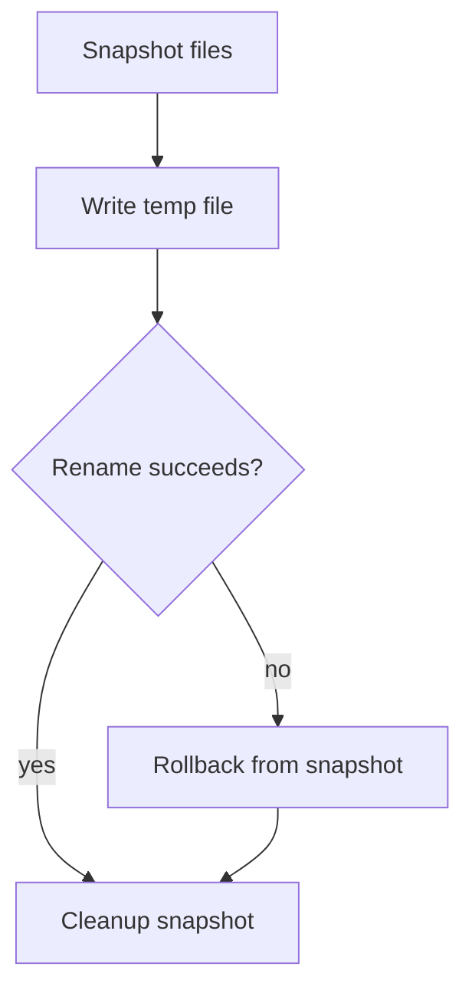

# sndv-scalpel (Rust)

Production-ready structural-aware CLI for safe code discovery and scoped edits.

Creator lineage: Radoslav Sandov (Go prototype). Current Rust CLI version: `0.1.0`.

This repository migrates the prototype CLI from Go to Rust and hardens it for real usage with:

- async concurrent file processing
- buffered stream I/O
- transactional patch safety (snapshot, atomic write, rollback)
- pre-commit quality gates
- integration and e2e documentation
- GitHub collaboration templates
- LLM-oriented usage skill and guidance

## Status

- Migration baseline: complete
- Language coverage (config-driven): JavaScript, TypeScript, Go, Rust, Lua, Markdown, Text, YAML, JSON, JSONL, TOML
- Safety defaults: enabled (`diff` is dry-run, `patch` requires `--apply`)

## Install

```bash
cargo build --release
./target/release/scalpel --help
./target/release/scalpel --version
```

## OS Alias Setup

After you install the binary to a folder in your home path (for example `$HOME/.local/bin`), add an alias.

Linux/macOS (bash/zsh):

```bash
echo 'alias scalpel="$HOME/.local/bin/scalpel"' >> ~/.bashrc
source ~/.bashrc
```

PowerShell:

```powershell
Set-Alias scalpel "$env:USERPROFILE\\bin\\scalpel.exe"
```

## Cross-Platform Build and Packaging

Build target matrix (Linux/macOS/Windows targets):

```bash
./scripts/build-matrix.sh
```

Package target matrix:

```bash
./scripts/package-matrix.sh
```

## Install from GitHub Releases

Linux/macOS one-liner:

```bash
curl -fsSL https://raw.githubusercontent.com/thecharge/sndv-scalpel/main/scripts/install-from-github.sh | bash
```

Windows PowerShell:

```powershell
iwr https://raw.githubusercontent.com/thecharge/sndv-scalpel/main/scripts/install-from-github.ps1 -OutFile install-scalpel.ps1
powershell -ExecutionPolicy Bypass -File .\install-scalpel.ps1
```

Default config search order:

1. `--config <path>`
2. `SCALPEL_CONFIG`
3. `$XDG_CONFIG_HOME/scalpel/scalpel.yaml`
4. `$HOME/.config/scalpel/scalpel.yaml`
5. `config/scalpel.yaml` in the current project

## Quick Start

```bash
./scripts/build.sh
./target/release/scalpel find 'fn:*' tests/fixtures --recursive
./target/release/scalpel diff 'fn:CalculateTotal' tests/fixtures/sample.go --rename sum=total
./target/release/scalpel patch 'fn:CalculateTotal' tests/fixtures/sample.go --rename sum=total --apply
```


## Core Commands

```bash
# discover symbols
scalpel find 'fn:*' tests/fixtures --recursive

# inspect matched block
scalpel view 'fn:calculate_total' tests/fixtures/sample.rs --context 2

# paginated file peek from a position
scalpel peek tests/fixtures/sample.go --from-line 1 --page-size 5 --page 1
scalpel peek tests/fixtures/sample.go --from-pos 7 --to-pos 12 --all

# discover Lua functions from configured language registry
scalpel find 'fn:*' tests/fixtures/sample.lua

# structured key discovery in JSON/TOML
scalpel find 'key:*' tests/fixtures/sample.json
scalpel find 'key:*' tests/fixtures/sample.toml

# metadata for a file
scalpel info tests/fixtures/sample.go

# preview rename inside matched symbol scope only
scalpel diff 'fn:CalculateTotal' tests/fixtures/sample.go --rename sum=total

# apply rename with transactional safety
scalpel patch 'fn:CalculateTotal' tests/fixtures/sample.go --rename sum=total --apply

# swap full function block using file content
scalpel patch 'fn:CalculateTotal' tests/fixtures/sample.go --body-file /tmp/new-total.go --apply

# swap full method block using inline body text
scalpel patch 'method:chooseTier' tests/fixtures/sample-complex.ts --body 'public chooseTier(amount: number): "basic" | "enterprise" { return "basic"; }' --apply

# scoped literal replacement (ternary, if blocks, argument lists)
scalpel patch 'fn:main' app.js --replace 'flag ? true : false=>flag ? 1 : 0' --apply

# scoped replacement in text and data files
scalpel patch 'key:status' tests/fixtures/sample.txt --replace 'queued=>running' --apply
scalpel patch 'key:service.mode' tests/fixtures/sample.json --replace 'safe=>strict' --apply
scalpel patch 'key:mode' tests/fixtures/sample.yaml --replace 'safe=>strict' --apply
scalpel patch 'key:service.mode' tests/fixtures/sample.toml --replace 'safe=>strict' --apply
scalpel patch 'key:line1.state' tests/fixtures/sample.jsonl --replace 'queued=>running' --apply

# swap Go grouped imports as one block
scalpel patch 'import:import' tests/fixtures/sample-import-groups.go --body-file /tmp/imports.go.frag --apply

# update one import line in JS/TS/Rust by index when multiple imports exist
scalpel find 'import:*' app.ts
scalpel patch 'import:*' app.ts --index 2 --replace 'from "lib-a"=>from "lib-b"' --apply

# complex TypeScript operations on class/method blocks
scalpel patch 'method:computeInvoice' tests/fixtures/sample-complex.ts --body-file /tmp/compute-invoice-method.tsfrag --apply
scalpel patch 'class:InvoiceRepository' tests/fixtures/sample-complex.ts --body-file /tmp/replacement-class.tsfrag --apply

# generate bash completion
scalpel completion bash > /tmp/scalpel.bash
source /tmp/scalpel.bash
```

## Safety Model

1. Parse and match symbol range.
2. Generate a diff preview.
3. If `--apply` is provided: snapshot original file(s).
4. Write through buffered temp file.
5. Commit with atomic rename.
6. Roll back snapshot if any write fails.



## Async, Buffers, Streams

- Async runtime: Tokio multi-thread runtime.
- Concurrent traversal and parse: futures stream with bounded unordered buffering.
- Buffered streaming reads: `tokio::io::BufReader` + line-by-line stream reads.
- Buffered writes: `tokio::io::BufWriter`.

## Test Coverage and Proof

Run:

```bash
cargo test --all-targets
```

Includes:

- unit tests for parser and query behavior
- integration tests for required language coverage and side flows
- dry-run and apply-path verification for diff/patch commands
- critical rollback chaos test for failed writes
- heavy test with 10k LOC file parsing

Targeted large JSONL precision proofs:

```bash
cargo test --test heavy_paths huge_jsonl_surgical_patch_single_line_only
cargo test --test heavy_paths deep_line_target_jsonl_patch
cargo test --test heavy_paths huge_jsonl_diff_does_not_modify_file
cargo test --test heavy_paths fixture_big_jsonl_precise_line_patch
```

Run with local scripts:

```bash
./scripts/handle.sh check
```

## Pre-Commit Hooks

Install:

```bash
./scripts/install-hooks.sh
```

Hook checks:

- `cargo fmt --all -- --check`
- `cargo clippy --all-targets --all-features -- -D warnings`
- `cargo test --all-targets`

## Documentation

- Architecture: docs/architecture.md
- Language matrix: docs/language-support.md
- Quick start: docs/quickstart.md
- Usage guide: docs/usage-guide.md
- Integration and e2e: docs/integration-e2e.md
- Compliance and proof: docs/compliance-and-proof.md
- Extension guide: docs/extension-guide.md
- Development guidelines: docs/development-guidelines.md
- Features and issue flow: docs/features-and-issues.md
- Design choices FAQ: docs/design-decisions.md
- LLM usage (tools/framework/workflow/CI examples): docs/llm-usage.md
- Release artifacts: docs/release-artifacts.md
- LLM skill file: SKILL.md

Complex TypeScript fixture for advanced examples:

- `tests/fixtures/sample-complex.ts`

Containerized CLI suite and usage guide generation:

- `./scripts/podman-e2e.sh` builds the binary, runs CLI scenarios in Podman, and regenerates `docs/usage-guide.md` with real output.
- `./scripts/generate-usage-guide.sh` can be run directly when a local binary already exists.

## Collaboration and Governance

- Contribution workflow: CONTRIBUTING.md
- Security policy: SECURITY.md
- Code of conduct: CODE_OF_CONDUCT.md
- Dependency management automation: .github/dependabot.yml
- Pull request template: .github/PULL_REQUEST_TEMPLATE.md
- Issue templates: .github/ISSUE_TEMPLATE

## Project Layout

```text
src/
	app.rs            # app entrypoint and dispatcher bootstrap
	cli.rs            # clap command model
	commands/         # command handlers (find/view/info/patch)
	config.rs         # centralized config model and loader
	constants.rs      # shared constants and tokens
	parser/           # parser strategies and streaming I/O
	query.rs          # shorthand + glob matching
	transaction.rs    # snapshot + atomic write + rollback
	model.rs          # symbol and output models
	lang.rs           # dynamic language registry
	error.rs          # typed domain errors
tests/
	cli_integration.rs
	heavy_paths.rs
	transaction_chaos.rs
	fixtures/
docs/
	architecture.md
	quickstart.md
	language-support.md
	integration-e2e.md
	development-guidelines.md
	release-artifacts.md
	extension-guide.md
	llm-usage.md
```
